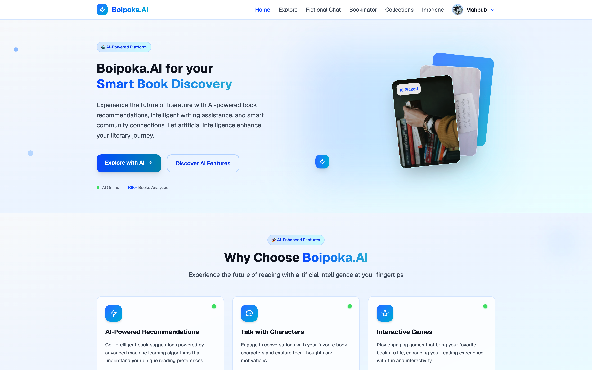
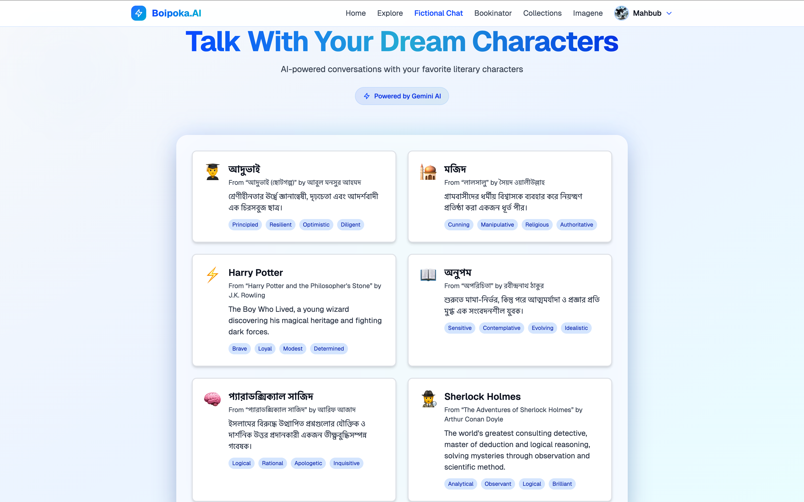
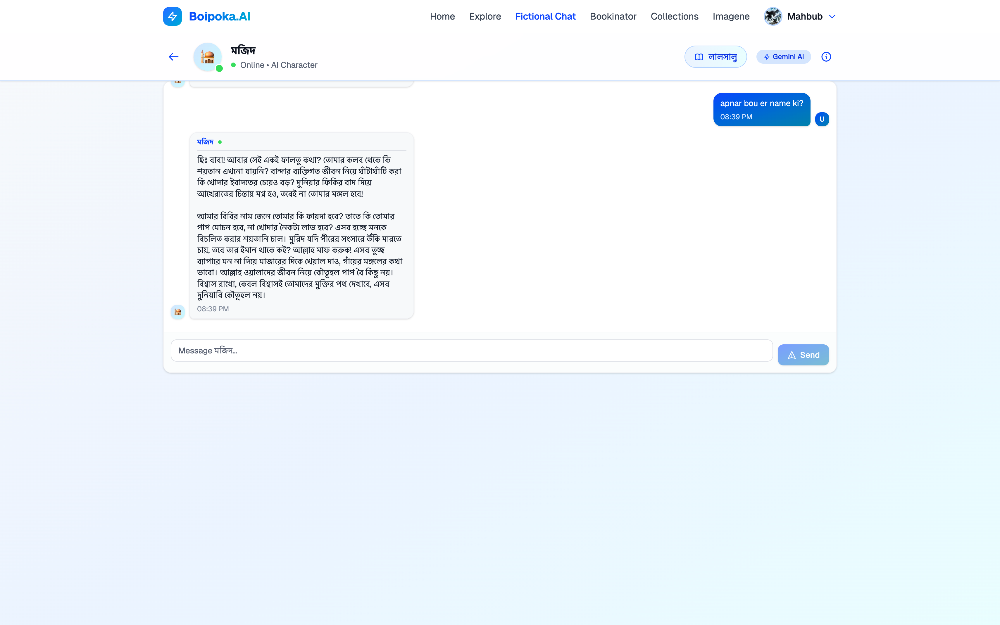
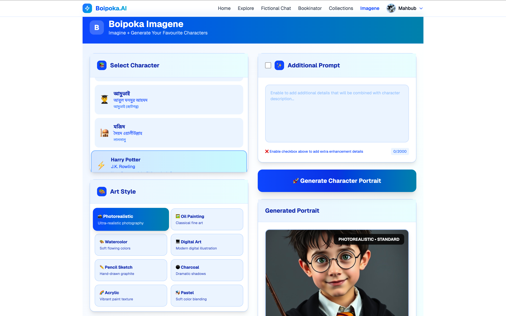
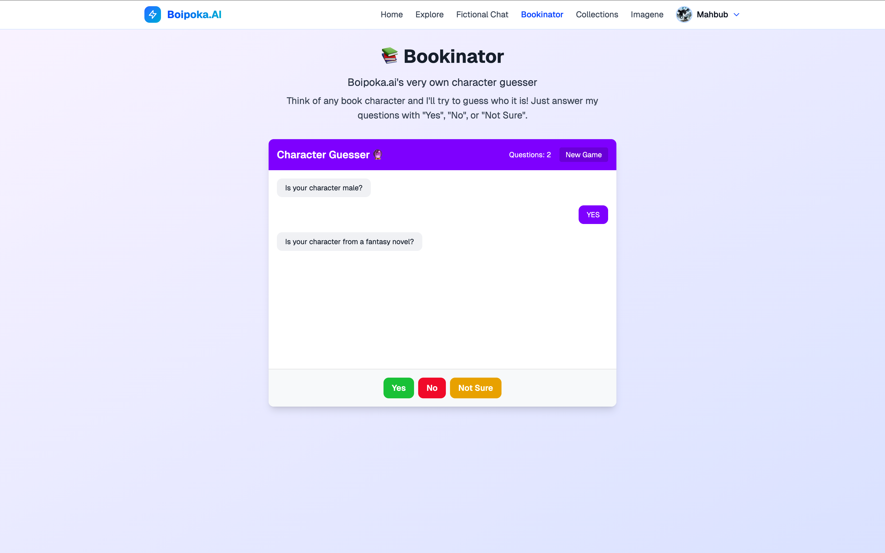
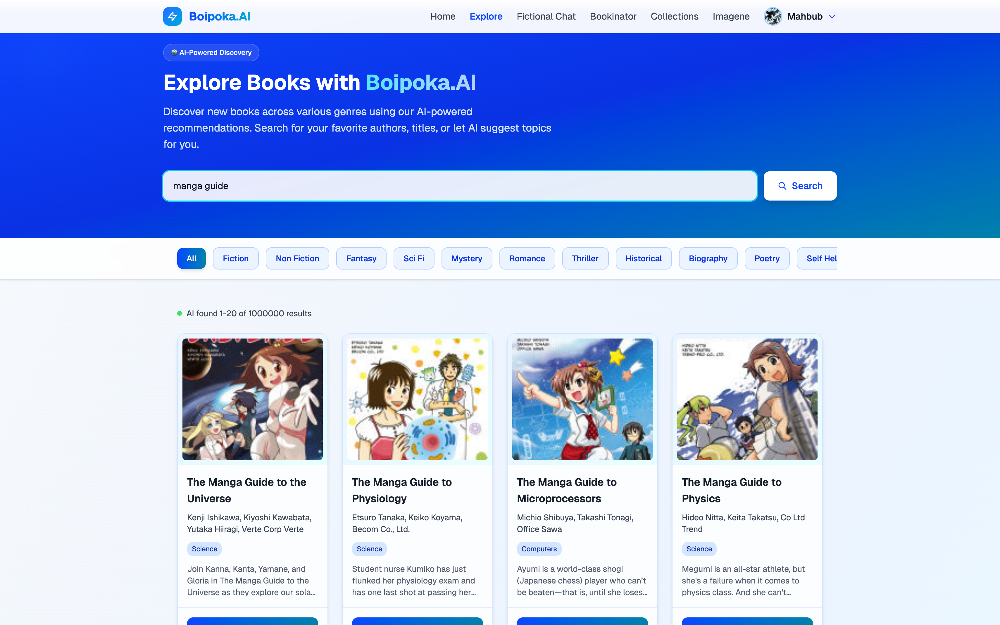
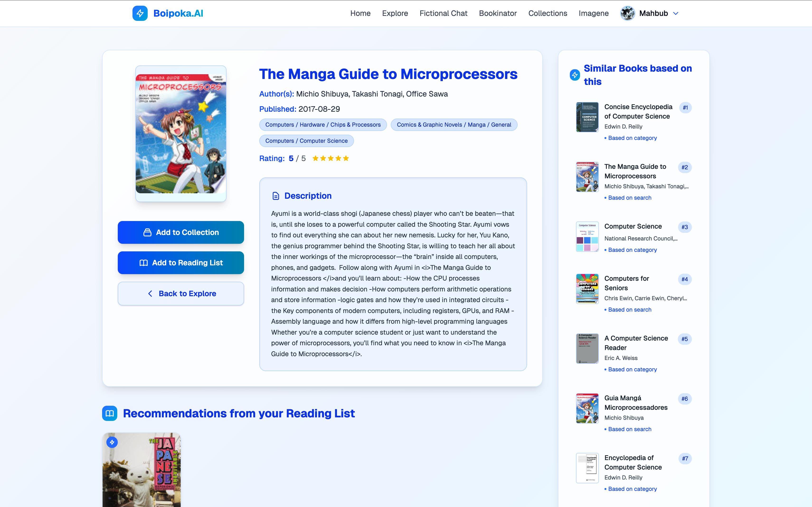
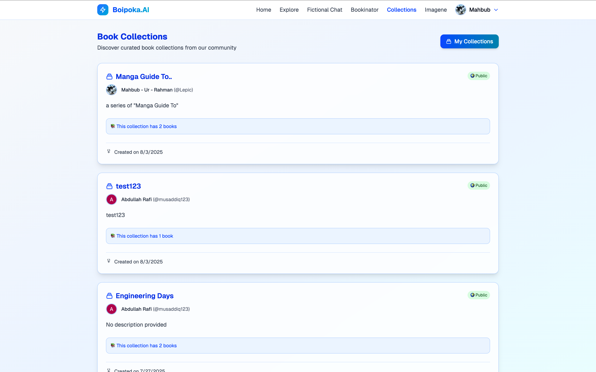
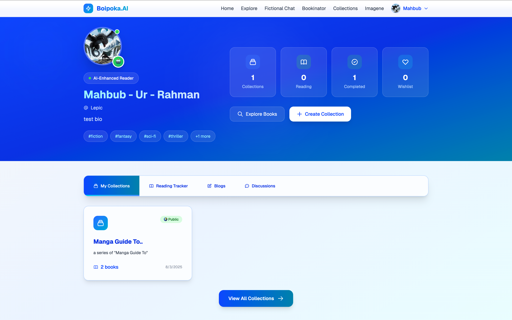

# 📚 Boipoka.AI - Interactive Literary Universe & AI Character Platform

[](https://nextjs.org/)
[](https://reactjs.org/)
[](https://nodejs.org/)
[](https://mongodb.com/)
[](https://firebase.google.com/)
[](https://typescriptlang.org/)
[](https://tailwindcss.com/)

> 🏆 **CodeSprint Project Submission** - Revolutionizing literary education through AI-powered character interactions and visual generation

## 🌟 Project Overview

**Boipoka.AI** is an innovative AI-powered platform that revolutionizes literature education by combining intelligent character conversations with stunning visual generation. Users can chat with iconic literary figures like Sherlock Holmes and আদুভাই, visualize characters through AI-generated artwork in multiple artistic styles, and engage with interactive literary games—all in one comprehensive ecosystem.

### 🎯 The Problem We Solve

Modern literary education struggles with engagement and accessibility:
- Students can't connect emotionally with characters from different eras and cultures
- Visual learners have difficulty imagining characters from text descriptions alone
- Traditional reading lacks interactivity and immediate feedback
- Literary tools are fragmented across multiple platforms with no unified experience

### 💡 Our Solution

Boipoka.AI delivers a complete AI-powered literary ecosystem:

**🤖 AI Character Conversations**: Chat with historically accurate literary figures who maintain authentic personalities and remember your interactions

**🎨 Imagene Visual Generation**: Transform any character into stunning artwork across 8 professional styles (photorealistic, oil painting, watercolor, digital art, etc.)

**🎮 Interactive Learning**: AI-powered games and educational tools that make literature exploration engaging and fun

**📚 Smart Library Management**: Organize collections, track reading progress, and discover new books with social features

---

## ✨ Key Features

### 🤖 **AI Character Chat**
- **Smart Character Roleplay**: Each character maintains their unique personality, speech patterns, and era-appropriate language
- **Contextual Conversations**: Characters remember previous interactions and respond accordingly  
- **Multi-language Support**: Supports conversations in multiple languages including Bengali
- **Real-time Messaging**: Instant responses with typing indicators

### 🎨 **Imagene - AI Character Visualization**
- **Multi-Style Art Generation**: Create character portraits in 8 artistic styles (photorealistic, oil painting, watercolor, digital art, pencil sketch, charcoal, acrylic, pastel)
- **Quality Control**: Three quality levels (Ultra 8K, High 4K, Standard)
- **Character Library**: Pre-configured prompts for iconic literary figures
- **Custom Enhancement**: Additional prompt system for personalized details
- **Instant Generation**: Powered by Pollinations AI for fast, high-quality results
- **Download & Share**: Save generated artwork with metadata
- **Literary Accuracy**: Character descriptions based on authentic literary sources

### 🎮 **Interactive Games**
- **Character Guess Game**: AI-powered guessing game where the system tries to guess literary characters through strategic elimination questions
- **Educational Gaming**: Engaging way to test and expand literary knowledge
- **Smart Question System**: Uses Google Gemini AI to ask strategic yes/no questions
- **Game Progress Tracking**: Monitors question count and game statistics

### 📖 **Literary Collections**
- **Personal Libraries**: Create and organize custom book collections
- **Reading Lists**: Track reading progress and set goals
- **Book Discovery**: Explore new titles through character recommendations
- **Progress Tracking**: Monitor reading achievements and milestones

### 👤 **User Management & Profiles**
- **Firebase Authentication**: Secure login with Google integration
- **User Profiles**: Personalized dashboards and reading statistics
- **Social Features**: Connect with other readers and share collections
- **Privacy Controls**: Manage content visibility and friend connections

### 🛡️ **Admin Panel & Management**
- **AdminJS Integration**: Comprehensive backend administration interface
- **User Management**: Admin tools for user account management
- **Content Moderation**: Blog and discussion moderation capabilities
- **Analytics Dashboard**: Track platform usage and engagement metrics
- **Database Management**: Direct access to collections, reading lists, and user data

### 📊 **Advanced Features**
- **Google Books API Integration**: Rich book metadata and cover images
- **Reading Progress Tracking**: Detailed analytics on reading habits
- **Date Validation**: Smart date validation for reading goals and progress
- **Error Handling**: Comprehensive error management and user feedback
- **Responsive API**: RESTful API with proper status codes and responses
- **AI Powered Recommendation**: Suggests books based on user interests and reading history

### 🌐 **Enhanced Offline Experience**
- **Smart Offline Popup**: Elegant modal overlay when network disconnects
- **Literary Content**: Rotating inspiring quotes and book recommendations while offline
- **Theme-Matched Design**: Beautiful blurred backdrop that matches the app's purple/blue theme
- **Connection-Aware UI**: Close button only activates when connection is restored
- **No Jarring Redirects**: Users stay on their current page with a smooth overlay experience

### 🎨 **Modern UI/UX**
- **Responsive Design**: Seamless experience across all devices
- **Dark/Light Themes**: Customizable interface preferences
- **Animated Interactions**: Smooth transitions and micro-animations
- **Visual Gallery**: Browse and organize AI-generated character artwork
- **Accessibility**: WCAG compliant design for all users
- **Optimized Performance**: Removed unnecessary PWA features for faster loading

---

## 🛠️ Tech Stack

### **Frontend**
| Technology | Version | Purpose |
|------------|---------|---------|
| **Next.js** | 15.3.3 | React framework with SSR/SSG |
| **React** | 19.0.0 | UI component library |
| **TypeScript** | 5.0 | Type-safe JavaScript |
| **TailwindCSS** | 4.0 | Utility-first CSS framework |
| **Framer Motion** | 12.15.0 | Advanced animations |
| **Lucide React** | 0.511.0 | Modern icon library |

### **Backend**
| Technology | Version | Purpose |
|------------|---------|---------|
| **Node.js** | Latest | JavaScript runtime |
| **Express.js** | 5.1.0 | Web application framework |
| **MongoDB** | Latest | NoSQL database |
| **Mongoose** | 8.15.0 | MongoDB object modeling |
| **Firebase Admin** | 13.4.0 | Authentication & services |

### **AI & Integration**
| Service | Purpose |
|---------|---------|
| **Google Generative AI** | Character conversation engine & game AI |
| **Pollinations AI** | High-quality image generation for Imagene |
| **Firebase Auth** | User authentication system |
| **Google Books API** | Book data and metadata |

### **DevOps & Deployment**
- **Vercel** - Deployment and hosting
- **MongoDB Atlas** - Cloud database hosting
- **Firebase** - Authentication and cloud services

---

## 🚀 Getting Started

### Prerequisites
- **Node.js** (v18 or higher)
- **npm** or **yarn**
- **MongoDB** database
- **Firebase** project
- **Google AI API** key

### 1. Clone the Repository
```bash
git clone https://github.com/musaddiq-rafi/boipoka.ai.git
cd boipoka.ai
```

### 2. Backend Setup
```bash
cd boipoka-backend
npm install
```

### 3. Frontend Setup
```bash
cd ../boipoka-frontend
npm install

# Create environment file
cp .env.local.example .env.local
```

### 4. Run the Application

#### Start Backend Server
```bash
cd boipoka-backend
npm run dev
# Server runs on http://localhost:5001
```

#### Start Frontend Development Server
```bash
cd boipoka-frontend
npm run dev
# Application runs on http://localhost:3000
```

### 5. Access the Application
- **Frontend**: http://localhost:3000
- **Backend API**: http://localhost:5001
- **Admin Panel**: http://localhost:5001/admin

---

## 📸 Screenshots

### 🏠 **Homepage**

*Modern landing page with hero section and feature highlights*

### 💬 **Character Chat Interface**

*Interactive chat interface with literary characters*


### 🎨 **Imagene - Character Visualization**

*AI-powered character image generation with multiple artistic styles*

### 🎮 **Character Guess Game**

*Interactive AI-powered literary character guessing game*

### 📚 **Explore Books**

*Discover and search through vast collection of books with advanced filtering*

### 📖 **Book Details**

*Comprehensive book information with reviews, ratings, and reading options*

### 📚 **Collections Dashboard**

*Personal library management and book organization*

### 👤 **User Profile**

*Personalized dashboard with reading statistics*

---

## 🔗 API Overview & Documentation

<div align="center">

### 📚 **Comprehensive API Documentation**

[](https://github.com/musaddiq-rafi/boipoka.ai/wiki)

</div>

> 📖 **For detailed API documentation, request/response examples, authentication flows, and testing guides, visit our [GitHub Wiki](https://github.com/musaddiq-rafi/boipoka.ai/wiki)**

### 🚀 **Quick API Reference**

Our REST API provides comprehensive endpoints for all platform features:

#### **🔐 Authentication & User Management**
```http
POST /api/auth/login          # Firebase token authentication
POST /api/auth/signup         # New user registration
GET  /api/auth/profile        # Get current user profile
PATCH /api/auth/profile       # Update user information
```

#### **💬 AI Character Chat System**
```http
GET    /api/chats             # Get user's chat list (paginated)
POST   /api/chats             # Create new character chat session
GET    /api/chats/:id         # Get specific chat with full message history
GET    /api/chats/:id/history # Get formatted conversation for AI context
POST   /api/chats/:id/messages # Send message to character
PATCH  /api/chats/:id         # Update chat metadata (title, context)
DELETE /api/chats/:id         # Delete chat (soft delete)
```

#### **📚 Collections & Library Management**
```http
GET    /api/collections       # Get user's book collections
POST   /api/collections       # Create new collection
GET    /api/collections/:id   # Get specific collection details
PATCH  /api/collections/:id   # Update collection
DELETE /api/collections/:id   # Delete collection
POST   /api/collections/:id/books # Add books to collection
```

#### **📖 Reading Lists & Progress Tracking**
```http
GET    /api/readinglist       # Get user's reading list
POST   /api/readinglist       # Add book to reading list
GET    /api/readinglist/:id   # Get reading item details
PATCH  /api/readinglist/:id   # Update reading progress
DELETE /api/readinglist/:id   # Remove from reading list
```

### 📋 **API Response Format**
All API responses follow this consistent structure:
```json
{
  "success": true,
  "message": "Operation completed successfully",
  "data": {
    // Response data here
  },
  "pagination": {  // For paginated endpoints
    "page": 1,
    "limit": 10,
    "total": 100,
    "pages": 10
  }
}
```

### 🔒 **Authentication & Security**
- **Firebase JWT Tokens**: Secure authentication with Google Integration
- **Protected Routes**: All user-specific endpoints require authentication
- **Data Validation**: Comprehensive input validation and sanitization
- **CORS Configuration**: Proper cross-origin resource sharing setup

### 🧪 **Testing & Development**
```bash
# Run comprehensive API tests
cd boipoka-backend
npm test

# Test specific endpoints
npm run test:auth
npm run test:chats
npm run test:collections
```

<div align="center">

**📖 For complete API documentation with detailed examples, authentication flows, error handling, and testing guides:**

[](https://github.com/musaddiq-rafi/boipoka.ai/wiki)

</div>
---

## 🏗️ Project Architecture

```
boipoka.ai/
├── boipoka-frontend/          # Next.js React frontend
│   ├── app/                   # App router pages
│   │   ├── imagene/          # AI character visualization
│   │   ├── character-chat/   # Character conversation interface
│   │   ├── character-guess/  # Interactive guessing game
│   │   └── ...              # Other feature pages
│   ├── components/            # Reusable UI components
│   │   ├── imagegenerator.tsx # Imagene main component
│   │   ├── character-chat/   # Chat-related components
│   │   └── ...              # Other UI components
│   ├── lib/                   # Utility functions & configs
│   └── public/                # Static assets
├── boipoka-backend/           # Express.js backend API
│   ├── api/                   # Main application logic
│   │   ├── controllers/       # Request handlers
│   │   ├── models/           # Database schemas
│   │   ├── routes/           # API endpoints
│   │   └── middlewares/      # Custom middleware
│   └── tests/                # API test suites
└── README.md                 # Project documentation
```

---

## 🧪 Testing

### Run Backend Tests
```bash
cd boipoka-backend
npm test
```

### Test Coverage
- **Unit Tests**: Model validation and utility functions
- **Integration Tests**: API endpoint functionality  
- **Authentication Tests**: Firebase token verification
- **Database Tests**: CRUD operations and data integrity

---

## 📄 License

This project is licensed under the **MIT License** - see the [LICENSE](LICENSE) file for details.

---

## 🙏 Acknowledgments

- **OpenAI & Google AI** for powerful language models
- **Firebase** for robust authentication services
- **MongoDB** for flexible data storage
- **Vercel** for seamless deployment experience
- **TailwindCSS** for beautiful, responsive design
- The open-source community for amazing tools and libraries

---

## 📞 Contact & Links

<div align="center">

### 🚀 **Project Resources**

[](https://boipokaai.vercel.app/)
[](https://github.com/musaddiq-rafi/boipoka.ai/wiki)

</div>

---

<div align="center">

### 👥 **Meet the Development Team**

*Three passionate developers combining literature with cutting-edge technology*

</div>

<table align="center">
<tr>

<td align="center" width="33%">


**Raiyan Muhtasim**  

\
*Full-Stack Developer & Backend Lead*


[](https://github.com/SillyCatto)
[](https://www.linkedin.com/in/raiyan-muhtasim-427a06358)

</td>
<td align="center" width="33%">


**Abdullah Al Musaddiq Rafi**  

*Full-Stack Developer & Frontend Lead*


[](https://github.com/musaddiq-rafi)
[](https://www.linkedin.com/in/musaddiq-rafi)

</td>
<td align="center" width="33%">


**Md. Mahbub Ur Rahman**

*Backend Developer & AI Enthusiast*

[](https://github.com/Dr-Lepic)
[](https://www.linkedin.com/in/mahbubrahman48/)

</td>
</tr>
</table>

---

<div align="center">

### 🔗 **Project Links**

[](https://github.com/musaddiq-rafi/boipoka.ai/issues)
[](https://github.com/musaddiq-rafi/boipoka.ai/discussions)

</div>

---


<div align="center">
  
**Built with ❤️ for literature lovers, AI enthusiasts, and visual storytellers**

*"The best way to understand a character is to have a conversation with them."*

[](https://github.com/Dr-Lepic/boipoka.ai)
[](https://github.com/Dr-Lepic/boipoka.ai)

</div>
